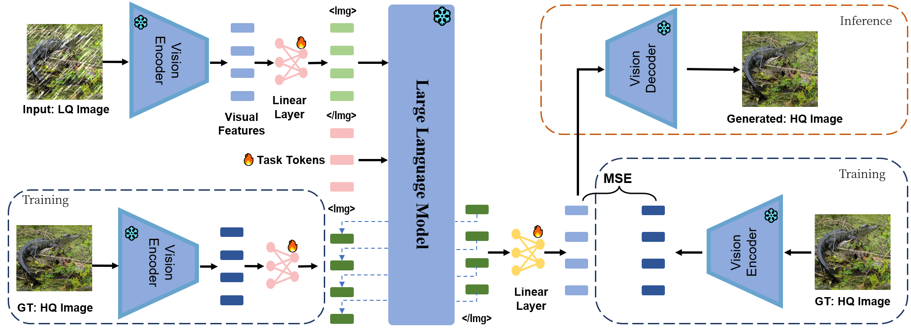

# LM4LV: A Frozen LLM for Low-level Vision
[](https://arxiv.org/abs/2405.15734)
🙋 **This is the official PyTorch implementation for "LM4LV: A Frozen Large Language Model for Low-level Vision Tasks"**





### What for ?

This codebase can be used for reproducing results in the [paper](https://arxiv.org/abs/2405.15734). Also it can be used for free-form general language-vision task with LLM, say, image captioning or text-to-image generation. You can define vision encoder, decoder and adapters freely by defining simple python classes with specific interfaces. We also support LLM LoRA finetuning.
### Environment Setup
To begin, create a new conda environment:

```bash
conda create -n LM4LV python==3.10
```

or simply make sure you have a python 3.10 installed in current environment.

Then install the packages required.

```
install torch , torchvision , torchaudio > 2.0 according to your cuda version (we use torch 2.2.0)
pip install -r requirements.txt
```
We use [DeepSpeed](https://github.com/microsoft/DeepSpeed) as the infrasturcture of all training and inference. Please assure that the DeepSpeed version > 0.92. If you don't know much about how to use DeepSpeed, see the [tutorial](https://www.deepspeed.ai/getting-started/).

### Data & Model
#### Models 
For models, you'll need a MAE and a Llama model as the base models in this pipeline. We use a fine-tuned version of MAE-Large and Llama2-chat for our main experiments. Note that you'll get significantly worse result if directly using the original MAE as the fine-tuned MAE is way better in image reconstruction.

You can download the official Llama2-chat weight [here](https://huggingface.co/meta-llama/Llama-2-7b-chat-hf). We release our fine-tuned version of MAE [here](https://huggingface.co/bytetriper/vit-mae-r). 🌟 The weight is already converted to huggingface format. You can directly load it by:

```python
from transformers import ViTMAEForPreTraining
model = ViTMAEForPreTraining.from_pretrained('$MODEL-FOLDER')
```

😭We currently do not support other non-llama LLMs as it requires specific modifications to the LLM code implementation. If you need to use other LLMs, create a new file for your LLM following the implementation of `src/model/modeling_llama.py` and modify the main code when loading LLM. We do not make additional changes to the original implementation except by changing the forward funtion to avoid calculating the cross entropy loss on vision tokens.
#### Data

##### Datasets
We use [LLAVA595k](https://huggingface.co/datasets/liuhaotian/LLaVA-CC3M-Pretrain-595K) (w/o text caption) as our base image dataset and [NoCaps](https://huggingface.co/datasets/HuggingFaceM4/NoCaps) as our test set. Simply collect the images (after convert them to png) and put them under seperate folders.
##### Data Format
We adopt a flexible data format the allows arbitrary interleaved multi-modal context. To insert images in text, simply use "\<image\>" to represent the image. For example, the sentence "How many apples are in \<image\>? And what can you infer about \<image\>?" have two images inserted. In the actual token sequence, "\<image\>" would be replaced with "\[visual embed]\</Img\>". We also support adding a sequence of soft tokens in anywhere you like by simply using "\<task\>".

In the training of LM4LV, a slice of data look like this:

```json
{
    "task_type": "conversation",
    "conversations": [
        {
            "role": "human",
            "value": "<image> <task>"
        },
        {
            "role" : "gpt",
            "value": "<image>"
        }
    ],
    "image":[
        "$PATH_TO_LOW_QUALITY_IMAGE",
        "$PATH_TO_HIGH_QUALITY_IMAGE"
    ]
}
```
The `image` is a list that contains the path to images. Please include the **absolute path to the images.**

In generation, we still adopt the same format as training but cancel the response of `gpt`:

```json
{
    "task_type": "conversation",
    "conversations": [
        {
            "role": "human",
            "value": "<image> <task>"
        },
        {
            "role" : "gpt",
            "value": ""
        }
    ],
    "image":[
        "$PATH_TO_LOW_QUALITY_IMAGE",
    ]
}
```

The available `task_type` in the data are `conversation|simple`. When using `conversation`, LM4LV will generate a multi-turn chat sequence that contains the `role` and `value` in the data under the chat template you choose (see `conversations` for more templates). The available `role` are `human|gpt|none`, `human` and `gpt` correspond to `role1` and `role2` in the chat template, respectively. `none` indicates not using any role but directly append `value` to the context. 

If using `task_type:"simple"` and `role:none` simultaneously, the final sequence falls back to a purely concatenating the `value` without modification.

The final data would be a json file, containing list of slices:
```json
[
    slice1,
    slice2,
    ...
]
```

We include two examples in `data/` for your reference.
**Note**: LM4LV uses a default instruction-tuning techinique, solely calculating the loss on the `value` of `gpt` for both images and text.
### Training & Inference

We provide a number of scripts to play with LM4LV.

Assume your LLM is stored under `$LLM`, and MAE is stored under `$MAE`. And you've well-organized the data, saved in `train_data.json` and `test_data.json` respectively.

##### Vision Configuration 📓
Create a vision configuration file that is used for initializing vision modules. If you're using MAE, simply modify `ckpt_path` in `src/config/stage2_MAE.yaml` to `$MAE`. You'll need to do that both for the encoder and the decoder.

##### Training & Inference Configuration 📗
The DeepSpeed training configuration is stored in `src/config/train_bf16.yaml`. You can modify the configuration to fit your needs. The inference configuration is stored in `src/config/gen_bf16.yaml`. Note that a batchsize per gpu larger than 1 would cause some strange error like token mismatch. We recommend using a batchsize per gpu of 1 in generation. By default the LLM is frozen, but you can use LoRA-finetuning easily by setting the LoRA parameters in the configuration file.

We only test the pipeline of LM4LV using deepspeed stage 1 (DDP). Theoretically it should work with other stages but we do not guarantee the outcome. There is a stage 3 config in `src/config/train_ds3.yaml` if you want to try.

##### Training ♻️
For a default setup of 4 NVIDIA GPUs, simply run the script:

```bash
cd src/ 
chmod +x ./scripts/train_LM4LV.sh 
./scripts/train_LM4LV.sh $EXP_NAME \ 
$VISION_CONFIG_PATH(=config/stage2_MAE.yaml) \
$VISION_TOKEN_NUM(=197) \ 
$CKPT_PATH=none \ 
$DATASET_PATH=train_data.json
```

The logs, configurations and models will be save in `../ckpt/$EXP_NAME/`. `$VISION_TOKEN_NUM` is the number of visual tokens of the vision encoders. If the actual vision tokens number is larger than `VISION_TOKEN_NUM`, it'll be truncated to `$VISION_TOKEN_NUM`.

##### Inference 🏃‍♂️

For a default setup of 4 NVIDIA GPUs, simply run the script:

```bash
cd src/
chmod +x ./scripts/gen.sh
./scripts/gen.sh $EXP_NAME \ 
$VISION_CONFIG_PATH(=config/stage2_MAE.yaml) \
$VISION_TOKEN_NUM(=197) \
$CKPT_PATH=none \
$DATASET_PATH=test_data.json
```

The generated images would be saved in `../ckpt/$EXP_NAME/images/`.

All parameters are default to be frozen except for the task token (always trainable). To enable LoRA-finetuning, add `--lora_enable` in the script. To enable vision module training, add `--train_adapter , --train_deadpater, --train_encoder, --train_decoder` for training the corresponding modules.

For more costomizations, please see `src/train.py` and `src/batch_generate.py` for more details. This script runs well on 4xA100 80G GPUs. If you're using other GPUs, you may need to adjust the batch size accordingly.

### Evaluation 🕐

You can use `evaluate.py` to evaluate the PSNR/SSIM between two set of images:

```bash
python evaluate.py $PATH_TO_GT $PATH_TO_IMAGE [psnr|ssim]
```

If two images are identical, we set the PSNR to be 100 to avoid overflow. 

### Finetuning MAE 👉

If you're interested in fine-tuning the MAE, we also provide the script and code for fine-tuning MAE for image reconstruction. By default, we use $\Vert x - MAE(x) \Vert_1 + \lambda\cdot \text{LPIPS}(x, MAE(x)),\lambda = 1$ as the loss function. 

Simply run:

```bash
./scripts/ftMAE.sh $EXP_NAME \
$MAE_VISION_CONFIG_PATH \
$STAGE1_CKPT_PATH(=none) \
$PATH_TO_IMAGENET_TRAIN_SET
```

The model will be saved in `../ckpt/$EXP_NAME/`. 

Use fine-tuned MAE to reconstruction using:

```bash
./scripts/evalMAE.sh $EXP_NAME\
$MAE_VISION_CONFIG_PATH \
$MAE_CKPT_FOLDER_PATH \
$PATH_TO_IMAGE \
$PATH_TO_SAVE_IMAGE 
```

This script seems to only support single-GPU now.

### More to explore 🔥

LM4LV also provides enough freedom to change the vision modules, adapters and vision loss easily. We decouple those components from our main pipeline, allowing one to develop new type of vision modules by simply defining a class that follows specific interfaces. See `src/model/vision_modules.py` and `src/model/losses.py` for calling conventions.

We provide a variety of vision encoders/decoders and adapters in `src/model/vision_modules.py`. You can use them simply by changing the vision configuration. We provide two examples of using BEiT and VQGAN in `src/config/stage2_BEiT.yaml` and `src/config/stage2_vqvan.yaml` respectively. 

LM4LV pipeline can also be used for normal vision-language tasks. We provide a training script in `src/scripts/train_LLAVA_stage1.sh` and `src/scripts/train_LLAVA_stage2.sh`. In vision-language tasks, we often mask a prefix of the model's response in addition to instruction-tuning. For example, [LimBER](https://arxiv.org/abs/2209.15162) add 'a picture of' in the beginning of the response and do not calculate loss on it. We support this by adding a commandline parameter `--gpt_prefix`, which will add the user-specified prefix to every gpt response in the data.

### Acknowledgement 😙
A large portion of this codebase is based on the [OPENLAMM](https://github.com/OpenGVLab/LAMM), thanks to the authors for their great work. We also use [taming](https://github.com/CompVis/taming-transformers) and [basicsr](https://github.com/XPixelGroup/BasicSR) for the vision modules and evaluation.

### Citation
💓If you find this work helpful, please consider citing:
```
@article{zheng2024lm4lv,
  title={LM4LV: A Frozen Large Language Model for Low-level Vision Tasks},
  author={Zheng, Boyang and Gu, Jinjin and Li, Shijun and Dong, Chao},
  journal={arXiv preprint arXiv:2405.15734},
  year={2024}
}
```